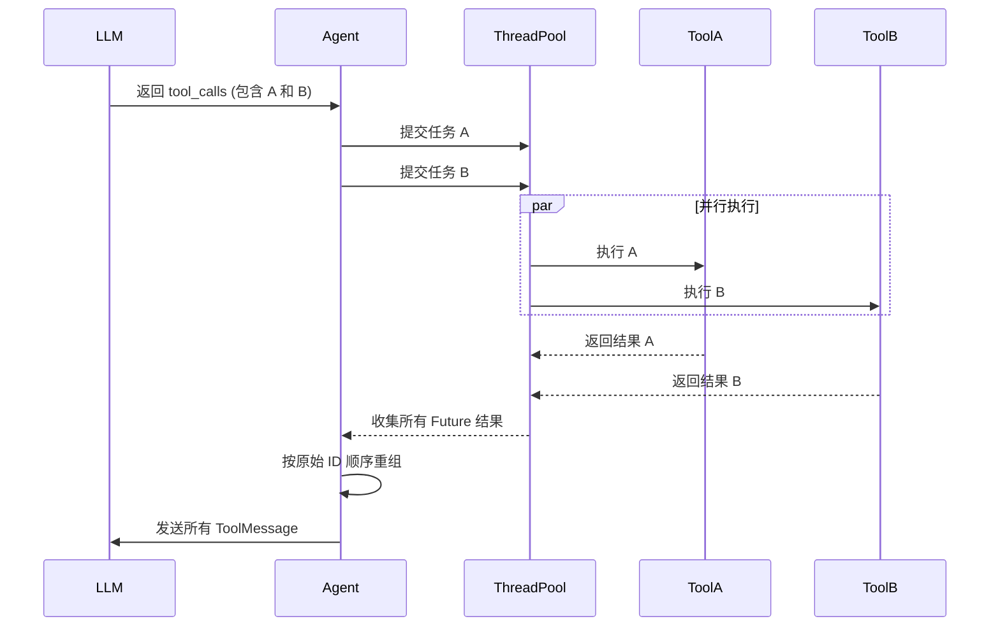

```mermaid
sequenceDiagram
    participant LLM
    participant Agent
    participant ThreadPool
    participant ToolA
    participant ToolB

    LLM->>Agent: 返回 tool_calls (包含 A 和 B)
    Agent->>ThreadPool: 提交任务 A
    Agent->>ThreadPool: 提交任务 B
    par 并行执行
        ThreadPool->>ToolA: 执行 A
        ThreadPool->>ToolB: 执行 B
    end
    ToolA-->>ThreadPool: 返回结果 A
    ToolB-->>ThreadPool: 返回结果 B
    ThreadPool-->>Agent: 收集所有 Future 结果
    Agent->>Agent: 按原始 ID 顺序重组
    Agent->>LLM: 发送所有 ToolMessage
```